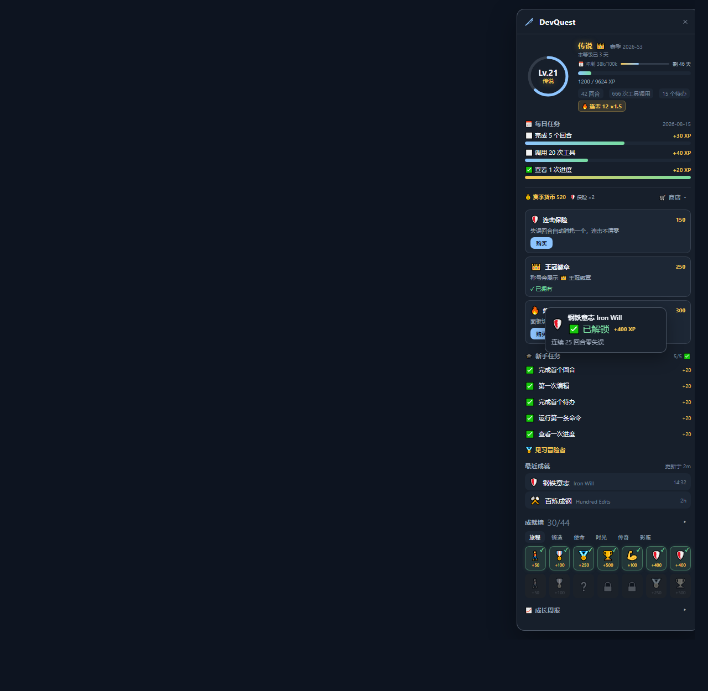
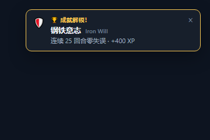

# ⚔️ DevQuest — Turn Your Dev Work into an RPG

[中文](README.md) | **English**

> DevQuest is a DSH plugin: every turn, tool call, todo and token output in your agent is converted into XP by fixed rules. XP raises your level, levels unlock titles, and achievements track how far you've come. Install it and do nothing else — normal work scores automatically.

<p align="center">
  <strong>🎴 Random Event Cards</strong> · <strong>🔥 Combo Stances</strong> · <strong>🪙 Relic Collection</strong> · <strong>📜 Epic Quest Chains</strong> · <strong>👻 Ghost Race</strong> · <strong>📅 Daily Quests + Chest</strong> · <strong>🗓️ Weekly Challenges + Boss</strong> · <strong>🎯 Daily Goal</strong> · <strong>🃏 Class System</strong> · <strong>🛒 Season Shop</strong> · <strong>🏆 58 Achievements + Rarity</strong> · <strong>🏷️ Multiple Titles</strong> · <strong>📊 Stats + Hall of Fame</strong>
</p>

<p align="center">
  <a href="https://github.com/lucky8197/dsh-devquest/blob/main/LICENSE"></a>
  <a href="https://github.com/lucky8197/dsh-devquest"></a>
  <a href="https://www.npmjs.com/package/dsh-devquest"></a>
  
  <a href="https://github.com/lucky8197/dsh-devquest/actions/workflows/test.yml"></a>
  
  
</p>

---

## 🎮 How It Works

Nothing to configure — just work, and XP accrues:

| You do | You get |
|---|---|
| ✅ Complete a turn | +10 XP, combo +1 |
| 🧰 Call a tool | +1 XP (crafting tools like edit/cmd/SSH +2, capped +10 per turn) |
| 📋 Clear todos | +15 XP each |
| 📝 Output tokens | +1 XP per 10k |
| 💥 Fail a turn | +2 XP (consolation) |
| 💪 Rise after a failure | "Rise Again" achievement +100 XP |
| 🎴 Every 20 completed turns | Roll the "Fate Dice": a random event card (buff / curse / choice) |

## ✨ Key Features

### 🎴 Adventure (v1.4.0)
- 🎴 **Random event cards**: every 20 turns — ☕ Caffeine Rush (tool XP ×2), 🧘 Deep Focus (token XP ×1.5), 👻 Ghost Bug (next failure won't break combo), 🧱 Tech Debt Collector (next XP wiped), 🥚 Mystery Egg choice, 🌙 Midnight Choice, 🎲 Fate Gamble
- 🔥 **Combo stances**: unlock Flow / Surge / Phoenix / Ascend at 10/25/50/100 combo (extra tool XP + token multiplier), shown as a hero badge
- 🪙 **Developer relics**: 24 rarity-tiered collectibles dropped from todo sweeps / boss kills (egg buff doubles the chance), with a collection showcase
- 📜 **Epic quest chains**: 3 multi-day storylines (Tame the Tech Debt / Legend of the Night Owl / Bug Slayer) — advance daily, reset on a missed day, finales up to +800 XP
- 👻 **Ghost race**: your past 7 days of real data become "Past You" — dual progress bars (XP/turns), beat it for +300 XP
- 💬 **Meme-flavored copy**: daily quests get meme variants (~60%), weekly bosses draw from a meme-name pool (Refactor Behemoth / Tech Debt Wyrm…)

### 🎮 Progression
- ⚔️ **Turns/tools/todos/tokens → XP → level → title**: a new title every 5 levels (30+ tiers), bigger combo = bigger multipliers
- 🏆 **58 achievements** across six categories (Journey/Crafting/Quest/Time/Legend/Egg), rarity-colored, with hidden easter eggs and category collection bonuses

### 📅 Daily & Weekly
- 📅 **Daily quests**: 3 random quests per day (24-quest pool), clear all for a chest
- 🎯 **Daily XP goal**: set today's target, claim a reward on reaching it
- 🗓️ **Weekly challenges**: 3 goals per week, clear all for a bonus
- 🐉 **Weekly boss**: the 3 weekly quests fuse into a boss — slay it for season currency
- 🎁 **Daily lucky draw**: free daily draw for XP / currency / items

### 🗓️ Season & Shop
- 🗓️ **Quarterly seasons**: season XP is the shop currency (resets each season, anti-inflation), with a sprint bar, pass milestones, and an auto season wrap-up
- 🛒 **Season shop**: combo shields / quest rerolls / XP boost cards / skip cards / title badges

### 🎨 Personality & Looks
- 🎨 **Theme skins**: 10 palettes, buy once — own forever, switch free
- 🏷️ **Multiple titles**: level titles + conditional titles (All-Rounder, etc.), switch freely
- 🃏 **Class system**: your tool habits reveal a class (Edit Master / Command Runner / Versatile…)

### 📊 Data & Experience
- 📈 **Growth report / activity calendar / stats / hall of fame**: daily XP bars, 30-day heatmap, top-5 tools, season records
- 📤 **Share card**: one-click PNG of your level / title / stats
- 🔊 **Sound + desktop notifications**: feedback on achievements / level-ups / boss kills (toggleable)
- 🎨 **Customizable panel**: font scaling, compact mode, toast filter, drag positioning

## 🖥️ Screenshot

⚔️ entry at the sidebar bottom; click to open the draggable panel. Achievement/turn-settlement toasts pop in the corner:

<p align="center">
  
  
</p>

## ⚙️ Install

**Option 1: npm (recommended)**

```sh
dshpm install dsh-devquest --profile web
# or
dsh plugin --profile web add "dsh-devquest"
```

**Option 2: GitHub source**

```sh
dsh plugin --profile web add "github:lucky8197/dsh-devquest#main"
```

Restart dsh web → ⚔️ appears at the sidebar bottom.

Agents can query progress too:

```
devquest_status        # level / XP / combo / daily quests / class / boss
devquest_achievements  # full achievement list & unlock state (58)
devquest_shop          # season shop: balance/items, buy=<itemId>
devquest_daily         # daily+weekly brief (plain text, pushable to IM)
devquest_reset         # reset save (dangerous, needs confirm=true)
```

## 📄 License

BSD-3-Clause
