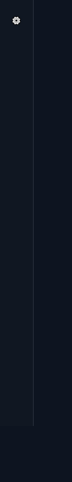

# ⚔️ DevQuest — 把开发变成 RPG

> 你的每一次 agent 协作，都在升级你的角色。完成回合、调用工具、清空待办、深夜赶工——一切都会化作 **XP**，点亮徽章，推着你从「学徒」一路走向「传说」。
>
> 生态里全是给你摸鱼的小游戏；DevQuest 反其道：**你的工作，就是游戏。**

<p align="center">
  <strong>📅 每日任务</strong> · <strong>🔥 连击加成</strong> · <strong>🏆 29 枚成就</strong> · <strong>📈 等级称号</strong> · <strong>🛠️ 事件流驱动 · 纯函数计分</strong>
</p>

---

## 🎮 怎么玩

**装上它，什么都不用做——玩代码，就是玩 DevQuest。**

| 你做了什么 | 你会得到 |
|---|---|
| ✅ 完成一个回合 | +10 XP，连击 +1 |
| 🧰 调用工具 | +1 XP（编辑/命令/SSH 等「锻造师」工具 +2） |
| 📋 清空待办 | 每个 +15 XP |
| 📝 输出 tokens | 每 10k +1 XP |
| 💥 犯错后爬起来 | 「东山再起」成就 +100 XP |

### 📅 每日任务

每天 **3 个随机任务**（按日期确定性抽取，同一天所有玩家看到的都一样）：

- 🗡️ 完成 5 / 15 个回合
- 🧰 调用 20 / 50 次工具
- ✏️ 编辑写入 10 次 · ⌨️ 命令行 10 次
- 📋 完成 5 个待办 · 📝 输出 50k tokens
- 🤖 派出 2 个子代理 · 👀 看一眼自己的进度

做完**自动结算 XP**，不用手动领。**天天有目标，天天有奖励。**

### 🔥 连击

连续完成回合触发倍率加成，失误清零——**稳住，别浪**：

| 连击 | 加成 |
|---|---|
| ≥ 5 | ×1.5 |
| ≥ 15 | ×2.0 |
| ≥ 30 | ×2.5 |

### 🏅 等级与称号

```
Lv.1-4     学徒 Apprentice
Lv.5-9     工匠 Artisan
Lv.10-14   锻造师 Forger
Lv.15-19   宗师 Master
Lv.20+     传说 Legend
```

每 5 级一档称号，每个里程碑都有成就徽章等着你。

### 🏆 29 枚成就 · 六大门类

**旅程** 初出茅庐 → 百回合大师 → 钢铁意志（连续 25 回合零失误）

**锻造** 初试锋芒 → 百炼成钢 → 远洋航行（首次 SSH）

**使命** 使命开始 → 使命达人 → 清道夫（单轮待办全清）

**时光** 夜猫子 · 早起的鸟儿 · 七日之约（连续 7 天活跃）· 肝帝（单日 50 回合）

**传奇** 工匠之路 → 锻造宗师 → 宗师之路 → 传说降临（20 级）

**🥚 彩蛋**（解锁前不显示，面板都找不到）：

- 🔒 **恶魔的低语** — 累计 666 次工具调用（+666 XP，懂的都懂）
- 🔒 **魔鬼时刻** — 凌晨 4:44 还在干活
- 🔒 **觉醒** — agent 偷偷查了自己的 DevQuest 进度
- 🔒 **手滑** — 工具失败后 1 分钟内，同一工具再次成功

## 🖥️ 长这样

侧边栏底部 ⚔️ 入口，点击弹出面板；成就解锁时右上角弹出金色 toast：

<p align="center">
  
  
  
</p>

面板里是：

```
┌──────────────────────────────┐
│  ⚔️ DevQuest          Lv.7   │
│  ▓▓▓▓▓▓▓▓▓░░░░░      62%    │
│  工匠 Artisan · 赛季 2026-S1 │
│  🔥 连击 12 ×1.5             │
│  ──────────────────────────  │
│  📅 每日任务 2026-08-15      │
│  ⬜ 完成 5 个回合   3/5  +30 │
│  ⬜ 调用 20 次工具  12/20 +40│
│  ✅ 查看 1 次进度   1/1  +20│
│  ──────────────────────────  │
│  ✨ 钢铁意志 Iron Will       │
│  ✨ 百炼成钢 2h ago          │
│  [成就墙 18/29 ▸]            │
└──────────────────────────────┘
```

面板可拖拽到任意位置（位置会记住）。成就解锁时右上角弹出金色 **🏆 toast**——升级的瞬间，连击燃烧、任务结算、徽章点亮，全是即时的。

## ⚙️ 安装

```sh
dsh plugin --profile web add "github:lucky8197/dsh-devquest#main"
```

重启 dsh web → 侧边栏底部出现 ⚔️ → 开始你的冒险。

模型也能查进度（连 agent 自己都会好奇）：

```
devquest_status        # 等级 / XP / 连击 / 今日任务
devquest_achievements  # 29 枚成就全清单与解锁状态
devquest_reset         # 重置存档（危险，需 confirm=true）
```

## 🛠️ 架构

```
session/event ──► listener ──► engine(纯函数) ──► store(JSON)
      ▲                                              │
      └────── devquest 工具 ◄── routes(HTTP) ◄────────┘
                                                    │
                                        slots.inject ──► DevQuestPanel
```

- **事件流驱动**：订阅 `session/event` firehose，不侵入任何 agent 循环
- **纯函数计分**：`Action → (XP, 成就判定)` 无副作用，35/35 单测全绿
- **存档本地化**：`~/.dsh/devquest/<项目-hash>.json`，按项目隔离，水位去重防重放

## 📄 License

BSD-3-Clause
